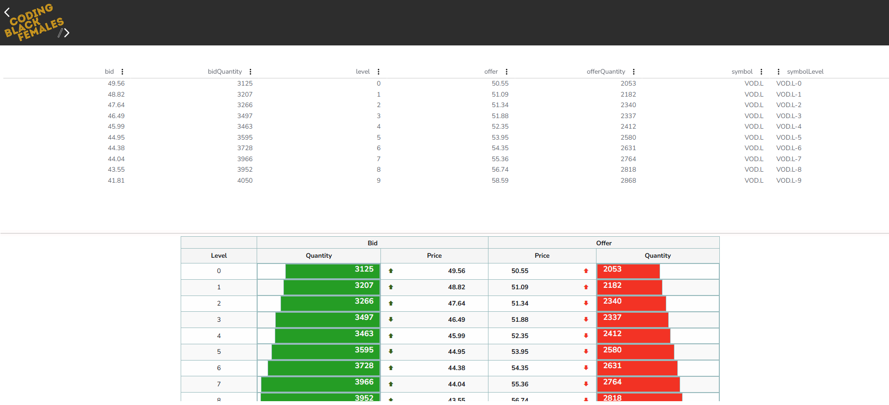

# Trading Algorithm Documentation

## Welcome to MYALGOLOGIC 

MyAlgoLogic is Trading Algorithm which aim to reduce market impact by splitting orders into smaller chunks. 
It starts by taking a Passive at Best Bid LONG position and Sell at Best bid to Flatten.


### CONTENTS

* [Overview](#overview)
  * [Project Goals](#project-goals)

* [Fork GitHub Repository](#fork-github-repository)
* [How to Get Started](#how-to-get-started)
  * [Pre-requisites](#pre-requisites)
  * [Opening the Project](#opening-the-project)
  * [Running Maven](#running-maven)
  

* [Writing My Logic](#writing-my-logic)
  * [Key Trading Strategies And Logic Flow](#key-trading-strategies-and-logic-flow)
  * [Logging and State Evaluation](#logging-and-state-evaluation)
  * [Order Management](#order-management)
  * [Risk Management ](#risk-management)
  * [Creating Buy Orders](#creating-buy-orders)
  * [Creating Sell Orders](#creating-sell-orders)
  * [Calculates VWAP](#calculates-vwap)
  * [Returns No Action](#returns-no-action)

* [Testing](#testing)
  * [UnitTesting](#unittesting)
  * [BackTesting](#backtesting)

* [Future Implementations](#future-implementations)

* [UI-Front-end](#ui-front-end)

* [Technologies Used](#technologies-used)
  * [Languages Used](#languages-used)
  * [Programs & Packages Used](#Programs--packages-used)  
  
* [Credits](#credits)
  * [References](#references)
  * [Acknowledgments](#acknowledgments)


- - -


### Overview

####  Project Goals

- This Project creates a simple trading algorithm that creates and cancels child orders. 
- The Stretch objectives which, implements a strategy centered around the Volume Weighted Average Price (VWAP),
for placing a Buy Order and the “Going Flat” Mechanism for placing a Sell Order to reduce position risk.

### Fork This GitHub Repository

Forking in GitHub allows you to create a copy of a repository on your own account, where you can view or make changes without affecting the original repository. To fork this repository, you can follow these steps:

1. Log in (or sign up) to Github.
2. Navigate to the [repository](https://github.com/Shida18719/trading-algo-assessment) on GitHub.
3. Click the "Fork" button, located on the top right of the page.
4. Choose the account where you want to fork the repository.
5. Once the process is completed, you will have a copy of the repository on your own account.

It's important to keep in mind that if you are not a member of an organization on GitHub, you will not be able to fork your own repository. You might want to create another account to do so.


### How to Get Started

#### Pre-requisites

1. The project requires Java version 17 or higher

##### Note
This project is configured for Java 17. If you have a later version installed, it will compile and run successfully, but you may see warnings in the log like this, which you can safely ignore:

```sh
[WARNING] system modules path not set in conjunction with -source 17
```

#### Opening the project

1. Fork this repo in GitHub and clone it to your local machine
2. Open the project as a Maven project in your IDE (normally by opening the top level pom.xml file)
3. Click to expand the "getting-started" module
4. Navigate to the [MyAlgoTest.java](https://github.com/cbfacademy/trading-algorithm-assessment/blob/main/algo-exercise/getting-started/src/test/java/codingblackfemales/gettingstarted/MyAlgoTest.java) and [MyAlgoLogic.java](https://github.com/cbfacademy/trading-algorithm-assessment/blob/main/algo-exercise/getting-started/src/main/java/codingblackfemales/gettingstarted/MyAlgoLogic.java)
5. You're ready to go!

##### Running Maven - Note

- This project utilises the Maven Wrapper ( mvnw ): an utility that allows you to run Maven projects without needing a pre-installed Maven version.
- You will first need to run the Maven `install` task to make sure the binary encoders and decoders are installed and available for use. 
- You can use the provided Maven wrapper or an installed instance of Maven, either in the command line or from the IDE integration.

- To get started, run the following command from the project root: `./mvnw clean install`. Once you've done this, you can compile or test specific projects using the `--projects` flag, e.g.:

- Clean all projects: `./mvnw clean`
- Test all `algo-exercise` projects: `./mvnw test --projects algo-exercise`
- Test the `getting-started` project only: `./mvnw test --projects algo-exercise/getting-started`
- Compile the `getting-started` project only: `./mvnw compile --projects algo-exercise/getting-started`

### Writing My Logic

#### Key Trading Strategies And Logic Flow

The key strategies and logic used within my algorithm are:

#### Logging and State Evaluation

- The algorithm logs the current state of the order book, which helps in understanding market conditions and making informed decisions.

#### Order Management
- Calculates Executed Quantity: Keeps track of the total quantity traded by checking the remaining quantity.
- The executed quantity is calculated by summing up the quantities of all child orders that have been placed. 
This is crucial for managing how much more can be traded without exceeding the specified limit.
- Before placing new orders, the algorithm checks how many active child orders exists
- Limits to 3 orders per side (buy/sell)
- Limits the number of child orders count to maximum of 5 to avoid excessive trading .


#### Risk Management
- Cancel unfilled Buy orders if the limitOrderPrice (VWAP) is higher than the Current price or equal to zero.
- Preserves partially filled orders
- Prevents cancellation of completed orders
- The algorithm dynamically adjusts the size of each order based on the available quantities, 
ensuring it doesn't place overly large orders that might move the market.


#### Creating Buy Orders
- The strategy compares the calculated VWAP (limitOrderPrice) with a predefined target VWAP (a threshold that serves as a benchmark for executing a trade) : `(limitOrderPrice < targetVWAP)`.
- Buy orders are created at best bid price (i.e., the highest price a buyer is willing to pay at that moment), implementing the Passive order placement.
- When conditions allows for fewer than 3 buy orders, the remaining quantity available, 
and only execute if limitOrderPrice (VWAP) is less than the target VWAP.


#### Creating Sell Orders
- Similarly, sell orders are created if there are fewer than 3 active sell orders, 
and it checks that the best bid is less than or equal to the best ask price to ensure there is a market for selling.
- It implements the “Going Flat” Mechanism to reduce position risk (Although not my originally planned Sell logic of “Bid >= Target Price”);
- This “Bid >= Target Price” logic created an order, but did not get executed.
- Hence, the going Fat only Break-Even, as the After trade profit analysis is 0.0 because it's using same best bid as the Entry Price.


#### Calculate VWAP
- Calculates VWAP using market's Bid Prices and the corresponding Quantities:
 `VWAP = Σ(Price * Volume) / Σ(Volume)`, as a benchmark to help decide, if the current VWAP price (limitOrderPrice) is below the target VWAP (targetVWAP)
- This average price is used to inform trading decisions throughout the algorithm, particularly in determining whether to buy.


#### Returns No Action
- Returns NoAction in a situation where there are no active orders.
- A sample use case : Before placing new orders, the algorithm checks how many active child orders exist. 
- If the count exceeds 5 or the total executed quantity reaches the limit, the algorithm returns `NoAction`, 
indicating no further trading should occur.


### Testing

 Test Configuration: The algorithm is provided with the following Target quantity and target VWAP data defined as a constants in the test class: 

   * Target Quantity: 3000
   * Target VWAP: 100


#### UnitTesting 

* Tests Cases Summary:
  1. Order Creation Limit (testCreateThreeChildOrders):
     - Asserts check three child orders created, if there are fewer than 3
  2. Order Quantity Validation (testExecutedOrderQuantity):
     - Asserts orders doesn't exceed the target quantity of 3000
  3. Return NoActions (testReturnNoActions):
     - Asserts check that NoAction should be returned when there are no active orders


#### BackTesting
* Tests Summary:
  1. Buy Order Creation (testBuyOrderCreated):
     - Asserts the number of active buy orders doesn't exceed 3
  2. Sell Order Creation (testSellOrdersCreated):
     - Asserts the number of active sell orders doesn't exceed 3
  3. Total Order Creation And FilledQuantity (testTotalOrderCreationAndFilledQuantity):
     - Validates the functionality of the algorithm with market data simulation
     - Asserts check six child orders created
     - Asserts filled quantity matches expected value of 1300 after market movement
  4. Total Order Count (testTotalOrderCount):
     - Checks how many child orders are currently active and limits the number to 5
  5. Order Cancellation (testCancelledOrderCount):
     - Checks exactly 1 order is cancelled under specific market conditions
     - Verifies 5 trades are successfully executed
     - Checks the presence of cancelled orders in active order list
  6. Filled Order State (testFilledOrPartialFilledOrders):
     - Asserts filled or partially filled orders should not be cancelled 
  7. Unfilled Buy Order Cancellation (testCancelUnfilledBuyOrder):
     - Check that unfilled buy orders are cancelled when VWAP exceeds current price.
  8. VWAP Buy Order Creation (testCalculateVWAPCreateBuyOrder):
     - Asserts buy order creation based on VWAP calculations
     - Ensures buy orders are created only when price is below target VWAP (100)
     - Check limit order price calculation against VWAP benchmark.


#### Future Implementations
- Since VWAP is a single-day indicator and restarts at the opening of each new trading day.
Attempting to create an average VWAP over many days could distort it and result in an incorrect indicator. 
- Exploring and implementing a Simple Moving Average over 3 - 5 days could be used to manage this limitation.

### UI-Front-end
The User Interface includes the following Components:
* MarketDepthFeature.tsx
* MarketDepthPanel.tsx
* PriceCell.tsx
* QuantityCell.tsx



### Technologies Used

#### Languages Used
* Java
* React - UI-Front-End

#### Programs & Packages Used

- GitHub to host the source code.
- Git to provide version control (to commit and push code to the repository).
- Maven Wrapper

## Credits

### References

* [Volume-Weighted-Average-Price, VWAP](https://www.investopedia.com/terms/v/vwap.asp)
* [Understading Trading Terms](https://www.machow.ski/posts/2021-07-18-introduction-to-limit-order-books/#stop-order)
* [VWAP Trading Strategy](https://medium.com/@tradingstrategy/vwap-trading-strategy-65a2f465fa42)
* [Java Docs](https://docs.oracle.com/en/java/javase/11/docs/api/java.base/java/util/stream/Stream.html)


## Acknowledgments

I would like to show my sincere appreciation to the following people who helped me along the way in completing this project:

  + My family, for their understanding, for being such an important part of my life, and for making every day a little bit brighter.
  + Course provider - Coding Black Females in Partnership with UBS.
  + CBF Tutor and Support teams.
  + UBS staffs.
  + The slack community, Entry To Tech Cohort for always being there.
  + My Cultural mentor - Gwin.


[Back to the Top](#trading-algorithm-documentation)

---

